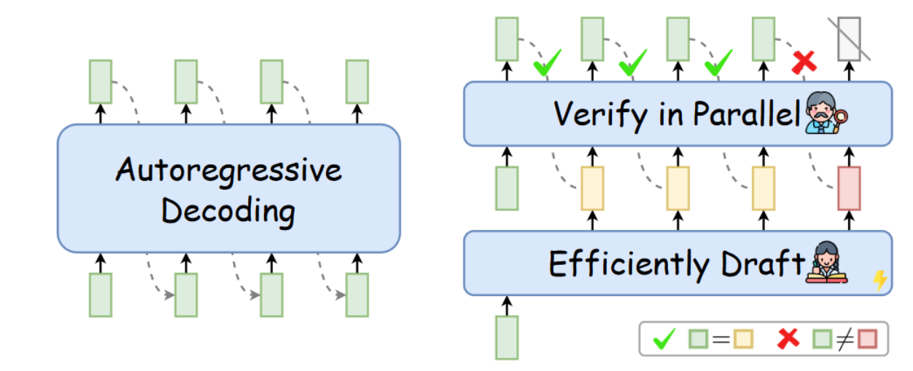
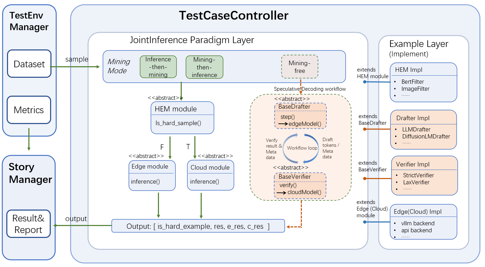

- [Cloud-Edge Speculative Decoding Benchmark for LLM based on KubeEdge-Ianvs](#cloud-edge-speculative-decoding-benchmark-for-llm-based-on-kubeedge-ianvs)
  - [Motivation](#motivation)
    - [Goals](#goals)
  - [Proposal](#proposal)
    - [Use Cases](#use-cases)
  - [Design Details](#design-details)
    - [Highlights](#highlights)
    - [Overall Architecture](#overall-architecture)
    - [Changes in Sedna](#changes-in-sedna)
    - [Changes in Ianvs](#changes-in-ianvs)
    - [Framework and Implementation Decoupling](#framework-and-implementation-decoupling)
    - [Speculative-Decoding Modules](#speculative-decoding-modules)
    - [Benchmark Construction](#benchmark-construction)
    - [Algorithm Exploration](#algorithm-exploration)
  - [Roadmap](#roadmap)

# Cloud-Edge Speculative Decoding Benchmark for LLM based on KubeEdge-Ianvs

## Motivation

Large Language Models have demonstrated strong capability in text generation, question answering, and a wide range of intelligent applications. As LLM-based systems are increasingly deployed in interactive scenarios, inference efficiency has become a critical system-level concern. This requirement is even more pronounced in cloud-edge environments, where users expect low-latency responses while the system must still preserve the quality and robustness of larger cloud models.

Speculative decoding is a promising technique for accelerating LLM inference. Rather than generating tokens strictly one by one with a single large model, a smaller or faster side first drafts several candidate tokens, after which a stronger model verifies and corrects them. This mechanism makes speculative decoding a natural candidate for cloud-edge collaboration, where the edge side can contribute fast draft generation and the cloud side can provide authoritative verification.

<p align="center">
  
</p>

<p align="center">
  Illustration of the speculative decoding idea: compared with autoregressive decoding, a drafter first proposes several tokens and a stronger model verifies them in parallel. Source: Figure 1 in <a href="https://aclanthology.org/2024.findings-acl.456/">Unlocking Efficiency in Large Language Model Inference: A Comprehensive Survey of Speculative Decoding</a>.
</p>

For readers who are not already familiar with speculative decoding, the key intuition is straightforward. Conventional autoregressive decoding uses one model to produce exactly one next token at a time, so the entire generation path is serialized. Speculative decoding changes this by separating **proposal** and **verification**: a smaller or cheaper model proposes several future tokens quickly, and a larger target model checks those proposals in one verification step. If the proposals are largely correct, the system can commit multiple tokens after one target-model verification pass, reducing the amount of strictly sequential decoding work.

Cloud-edge speculative decoding is a system-level adaptation of this idea. Instead of treating drafting and verification as two components inside one server, the benchmark maps them to two collaborative roles:

- the **edge-side drafter** is optimized for fast local proposal generation with a smaller model;
- the **cloud-side verifier** is optimized for higher-quality validation and correction with a stronger model.

This mapping is attractive because it matches the natural strengths of a cloud-edge deployment: the edge side can react quickly and draft ahead, while the cloud side provides stronger model capacity and final token-level authority. At the same time, this setting also introduces system issues that are not visible in single-machine speculative decoding, including communication overhead, synchronization frequency, request-local cache management, and the interaction between acceptance rate and network cost.

However, the effectiveness of speculative decoding in cloud-edge scenarios cannot be judged solely by local decoding speed. Communication overhead, verification frequency, draft acceptance rate, and collaboration policy all directly affect end-to-end performance. Accordingly, what is needed is not only an implementation of token-level collaboration, but also a benchmark example that can faithfully evaluate the actual cost and practical benefit of cloud-edge speculative decoding under Ianvs and Sedna.

### Goals

- Build a cloud-edge speculative decoding benchmark example by extending the KubeEdge-Ianvs `jointinference` paradigm with a practical token-level collaboration workflow.
- Explore more effective cloud-edge speculative decoding algorithms within the current benchmark framework.

## Proposal

We propose that KubeEdge-Ianvs adopt a cloud-edge speculative decoding benchmark implemented on top of Sedna `JointInference`, with the goal of evaluating and improving LLM inference efficiency in cloud-edge environments.

This proposal adopts Ianvs `jointinference` as the primary integration paradigm and extends it with speculative-decoding support. Under this design, the example provides dedicated `drafter` and `verifier` modules, while the paradigm layer implements the speculative-decoding workflow and organizes how these modules collaborate for one sample.

The key idea is to add a **new token-wise collaboration protocol** without disturbing the existing batch-wise inference abstractions used by other examples. Existing `edge` / `cloud` inference modules in Ianvs are designed around one-shot sample-level inference: they receive a sample-like input and return a final response-like output. In contrast, speculative decoding requires repeated token-wise interaction inside one sample. Therefore, this proposal introduces dedicated `drafter` and `verifier` modules whose inputs remain similar to existing inference modules, but whose outputs carry token-level intermediate results needed by the framework for multi-round collaboration.

At the same time, the proposal preserves the existing model-decoupling style of Ianvs examples. The `drafter` side and the `verifier` side are still independently configurable modules, so different edge models and cloud models can be hot-plugged through YAML configuration. The novelty is not in removing model decoupling, but in changing the module contract from **batch-wise final response** to **token-wise collaborative interaction**.

At the current stage, the proposal focuses on building and validating the speculative-decoding benchmark within the existing in-process execution model. On top of this stable foundation, the subsequent step is to explore more effective cloud-edge speculative-decoding strategies, such as improved draft-window design, acceptance-aware collaboration, and network-sensitive policy optimization.

### Use Cases

- Evaluate cloud-edge speculative decoding for LLM tasks.

## Design Details

### Highlights

This proposal differs from existing cloud-edge collaborative inference examples in Ianvs in the following respects:

- **Paradigm-level workflow extension**: the proposal implements the speculative-decoding workflow in the `JointInference` paradigm layer, so that the framework can organize repeated collaboration rounds for one sample.
- **Dedicated speculative-decoding modules**: the proposal introduces dedicated `drafter` and `verifier` modules, instead of overloading the existing `cloud` and `edge` modules with speculative-decoding-specific semantics.
- **Preserved module decoupling and implementation freedom**: like existing inference modules, `drafter` and `verifier` remain independently configurable, while the framework only owns the collaboration workflow and leaves model binding, backend choice, and algorithm-specific logic to the example implementation.
- **Token-wise module contract**: compared with existing batch-wise inference modules, the new `drafter` and `verifier` modules exchange token-level intermediate outputs such as proposed draft tokens, accepted tokens, corrected tokens, and stop/progress control signals.

### Overall Architecture

This proposal adopts Ianvs `jointinference` as the integration entry because speculative decoding in cloud-edge scenarios remains a joint-inference problem: one sample enters the controller, the paradigm layer organizes collaboration, and the example layer implements the concrete module behavior.

The design has two clear boundaries:

- **Change of Sedna**: implement `JointInference` as a workflow controller that can support repeated collaboration rounds for one sample.
- **Change of Ianvs**: keep Ianvs `joint_inference` as the controller-side wrapper that loads data, passes modules and configuration to Sedna, and collects benchmark outputs.

Under this design, the paradigm layer owns the workflow, while the example layer owns the actual behavior of the `drafter` and `verifier` modules.

More specifically, the runtime responsibility is divided as follows:

1. **Ianvs controller side** loads dataset samples, applies the dataset processor, and constructs a Sedna `JointInference` instance.
2. **Sedna `JointInference`** controls one speculative-decoding session for one sample.
3. **`drafter` module** represents edge-side speculative generation. In collaboration mode, Sedna calls `drafter.start_session(...)` and then repeatedly calls `drafter.step(...)` to produce draft proposals.
4. **`verifier` module** represents cloud-side verification. Sedna calls `verifier.start_session(...)` and then repeatedly calls `verifier.verify(...)` to check the latest draft proposal and return token-wise verification feedback.
5. **Sedna `JointInference`** uses the verifier feedback to decide whether another round is needed.
6. **Both modules close their request-local state** through `close_session(...)`, after which the final structured result is returned to Ianvs for metric evaluation.

This makes the framework call graph explicit: **edge inference is executed through `drafter`, cloud inference is executed through `verifier`, and the multi-round control loop is owned by the framework rather than by the example implementation**.

The current architecture is illustrated below:

<p align="center">
  
</p>


### Changes in Sedna

The main Sedna change is to implement the **speculative-decoding workflow support** in the `JointInference` paradigm layer. The workflow itself has already been illustrated in the architecture section; the Sedna-specific point here is the framework capability that must be added to support it. In this proposal, Sedna does not implement model-specific drafting or verification logic. Instead, Sedna is extended so that `JointInference` can:

- manage one request-local collaboration session across repeated rounds;
- coordinate `start_session(...)`, `step(...)`, `verify(...)`, and `close_session(...)`;
- decide whether the collaboration loop should continue or stop;
- return the final structured result back to Ianvs after the session finishes.

This design gives the paradigm genuine multi-round inference capability without embedding algorithm-specific drafting or verification details into the framework.

At the same time, the proposal keeps the framework boundary clear. The paradigm layer is responsible for coordinating repeated rounds through the speculative-decoding workflow, while the concrete model invocation remains inside the example-defined `drafter` and `verifier` modules. In this design, Sedna does not need to reinterpret the original `cloud` and `edge` modules for speculative decoding. Instead, the new modules make the speculative-decoding semantics explicit at the example layer.

In the current implementation, the Sedna-side speculative-decoding contract is intentionally small:

- `start_session`
- `step`
- `verify`
- `close_session`

The framework only coordinates these functions and determines whether to continue or stop. Token-state maintenance, model cache management, draft generation, verification logic, and result construction remain example-side responsibilities.

This design has two advantages:

- it keeps speculative-decoding-specific behavior separate from the existing cloud-edge module semantics;
- it makes the implementation easier for users to understand, because drafting and verification are represented by dedicated modules, while workflow control is clearly placed in the paradigm layer.
- it preserves compatibility with existing examples, because the original `cloud` and `edge` modules do not need to be reinterpreted and the speculative-decoding benchmark is isolated through the new `drafter` and `verifier` modules.

### Changes in Ianvs

On the Ianvs side, `joint_inference` continues to play the role of the controller-side wrapper. Ianvs loads the dataset, applies the optional dataset processor, builds the Sedna `JointInference` job, iterates over samples, and collects benchmark results. In this proposal, the Ianvs core flow can be reused as it is and does not require dedicated core-code modification for speculative decoding.

Accordingly, the Ianvs-side work is mainly concentrated in the example layer:

- implement the `drafter` module that performs speculative draft generation;
- implement the `verifier` module that performs cloud-side verification and correction;
- provide dataset processing that maps benchmark samples into the request format expected by the example;
- provide benchmark metrics and result parsing for latency, throughput, acceptance rate, and related outputs.

This division keeps Ianvs responsible for benchmark orchestration, while the example layer carries the benchmark-specific implementation details.

The example project structure is organized as follows:

```text
examples/cloud-edge-speculative-decoding-benchmark
├── benchmarkingjob.yaml
├── README.md
├── testalgorithms
│   └── speculative-decoding
│       ├── data_processor.py
│       ├── algorithms
│       │   └── ar
│       │       ├── drafter.py
│       │       └── verifier.py
│       └── test_speculative_decoding.yaml
└── testenv
    ├── acceptance_rate.py
    ├── end_to_end_latency.py
    ├── internal_token_latency.py
    ├── result_parser.py
    ├── testenv.yaml
    ├── throughput.py
    └── time_to_first_token.py
```

### Framework and Implementation Decoupling

The proposal explicitly separates **framework** and **implementation**:

- **Framework lies in core**: Sedna `JointInference` defines the speculative-decoding workflow and the minimal module contract required by the framework.
- **Implementation lies in the example**: the benchmark-specific drafting and verification logic is implemented under `examples/cloud-edge-speculative-decoding-benchmark/testalgorithms/speculative-decoding`.

This separation is important for algorithm exploration. The framework is not tied to one concrete speculative-decoding algorithm. Instead, it only requires that the example modules satisfy the framework contract. Different speculative-decoding methods can then be implemented by replacing the example-side module behavior while reusing the same framework loop.

In the current example, this relationship is reflected by inheritance:

- the example `drafter` implementation inherits from the framework-facing drafter base class (`BaseSpeculativeDrafter`);
- the example `verifier` implementation inherits from the framework-facing verifier base class (`BaseSpeculativeVerifier`);
- the concrete algorithm implementation is placed in the example module files such as `algorithms/ar/drafter.py` and `algorithms/ar/verifier.py`.

Therefore, the relationship between framework and implementation is:

1. **Core defines the protocol**.
2. **Example classes inherit the protocol-facing base classes**.
3. **Example implementations fill in the algorithm-specific behavior**.
4. **The framework executes the same workflow regardless of the concrete speculative-decoding algorithm**.

This is the main decoupling benefit of the proposal: **workflow reuse in core, algorithm variation in example**.

### Speculative-Decoding Modules

Based on the current design, the proposal introduces two dedicated example-side modules for speculative decoding, while the workflow itself is implemented in the paradigm layer.

#### drafter

The `drafter` module is responsible for speculative draft generation. It encapsulates how the drafting model is loaded, how inputs are interpreted, and how draft tokens and related metadata are produced for the workflow. This keeps drafting logic separate from the semantics of the original `edge` module.

From the framework perspective, the `drafter` module receives an input shape similar to existing inference modules: one request/sample together with runtime configuration. The novelty lies in the output. Instead of returning only a final batch-wise response, `drafter` returns token-wise intermediate outputs used by the framework in each collaboration round, such as:

- draft token ids;
- draft-side per-step logits or equivalent draft metadata;
- round-level control information for the next verification step.

Therefore, `drafter` should be understood as the **edge-side token proposer** in the speculative-decoding workflow.

#### verifier

The `verifier` module is responsible for verification and correction. It encapsulates how the verification model is invoked, how draft tokens are checked, and how accepted or corrected outputs are returned to the workflow. This keeps verification logic separate from the semantics of the original `cloud` module.

Similarly, the `verifier` module accepts a request/session input shape close to that of existing inference modules, but its output is token-wise and round-wise rather than batch-wise final-only. Typical verification output includes:

- accepted draft tokens;
- corrected tokens;
- stop/progress control;
- verification metadata needed by the next collaboration round.

Therefore, `verifier` should be understood as the **cloud-side token verifier and corrector** in the speculative-decoding workflow.


### Benchmark Construction

The benchmark is built around the current example implementation under `examples/cloud-edge-speculative-decoding-benchmark`. It reuses the existing Ianvs benchmarking workflow and focuses on evaluating speculative-decoding behavior under realistic collaboration cost.

The benchmark construction includes the following elements:

- Using a configurable evaluation dataset together with a dataset processor that normalizes request fields and supports sample-size control. The current example uses standard Ianvs dataset directories such as `dataset/gsm8k` and `dataset/humaneval`.
- Reusing the Ianvs benchmarking job configuration to organize experiment execution and ranking output.
- Ensuring that different speculative decoding methods can be evaluated under a consistent benchmark interface.

The benchmark is intentionally parameterized so that one implementation can cover both baseline and collaborative studies. The current example exposes the following important variables through YAML configuration:

- **Dataset and sample count**: the benchmark job selects one dataset per run, while the dataset processor controls how many samples are included in one evaluation run.
- **Inference mode**: `edge-only`, `cloud-only`, and `collaboration` are all executed through the same benchmark entry so that standalone and collaborative runs remain directly comparable.
- **Model pairing**: the `drafter` and `verifier` modules are independently configurable, allowing different edge/cloud model combinations to be tested under the same workflow and metrics.
- **Draft window size**: `draft_tokens_per_step` controls how many speculative tokens the edge-side drafter proposes per round.
- **Runtime and system settings**: prompt length budget, completion budget, backend choice, device placement, network-delay simulation, and timing/debug logging are configured through the shared runtime profile files.

The current implementation behind this benchmark is also layered in a way that matches the variables above:

- **`data_processor.py`** maps standard Ianvs datasets into the request format used by the speculative-decoding example.
- **`algorithms/ar/drafter.py`** implements edge-side speculative generation for both standalone edge inference and token-wise collaboration.
- **`algorithms/ar/verifier.py`** implements cloud-side verification, correction, and cloud-only generation.
- **`testenv/*.py`** implements benchmark metrics such as TTFT, throughput, internal token latency, end-to-end latency, and acceptance rate from the structured result outputs.

This construction makes the benchmark useful not only for reporting one result, but also for controlled ablation studies over mode selection, model size pairing, draft-window size, backend choice, and network assumptions.

The current metric set includes:

- Time to First Token
- Throughput
- Internal Token Latency
- End-to-End Latency
- Acceptance Rate

These metrics are already implemented under `examples/cloud-edge-speculative-decoding-benchmark/testenv` and, taken together, reflect both generation efficiency and collaboration effectiveness.

### Algorithm Exploration

Based on the current benchmark framework, the next step of the proposal is to further study cloud-edge speculative decoding at the algorithm level. The focus is to support algorithmic reproduction, design refinement, and method innovation within a stable benchmark setting.

Representative research directions include:

- Reproduction and benchmark-based evaluation of representative cloud-edge speculative decoding methods.
- Adaptive draft-window design based on runtime behavior.
- Acceptance-rate-aware drafting strategy to reduce ineffective speculative tokens.
- Network-sensitive collaboration policy that considers simulated communication delay when choosing collaboration behavior.
- Comparative evaluation of different edge/cloud model combinations and serving backends within the same benchmark framework.

## Roadmap

Phase 1 deliverables

1. Build a stable cloud-edge speculative decoding benchmark example on top of the extended Sedna `JointInference` entry.
2. Implement the paradigm-level speculative-decoding workflow together with benchmark data processing and metric evaluation, using a dedicated speculative-decoding module contract (`start_session`, `step`, `verify`, `close_session`).

Phase 2 deliverables

1. Reproduce representative cloud-edge speculative decoding methods within the benchmark framework.
2. Explore algorithmic improvements such as adaptive drafting strategy and acceptance-aware collaboration design.
